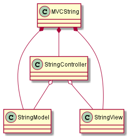
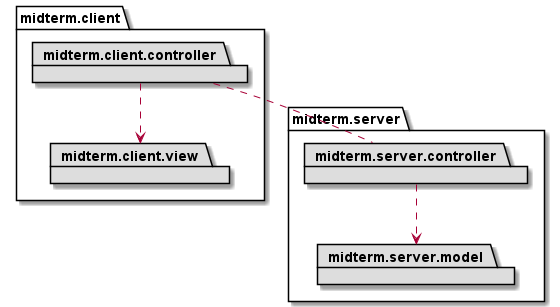
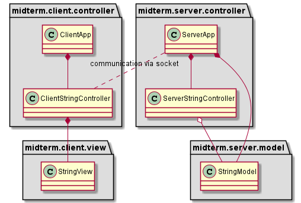
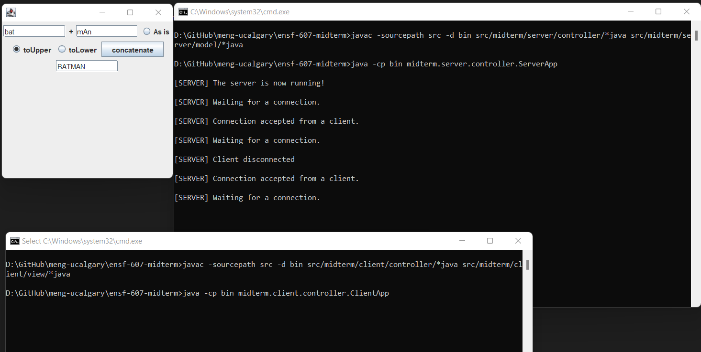

# ENSF-607 Midterm

Midterm on converting given application to client-server architecture with MVC pattern, while adding some more features.

## Folder Structure

- All source files are present in [src](src) folder.
- UML diagrams are present in [uml](uml) folder.
- Use the server script - [run_server.cmd](run_server.cmd) or [run_server.sh](run_server.sh) to launch the server. Launch the server only once.
- If you need to shutdown the server, you must the kill server process either by quitting the terminal or sending stop signal.
- Use the client script - [run_client.cmd](run_client.cmd) or [run_client.sh](run_client.sh) to launch clients. Launch as many clients as required.

## UML

UML diagram of existing system

UML diagram of new system at package level

UML diagram of new system at class level

## Screenshot

